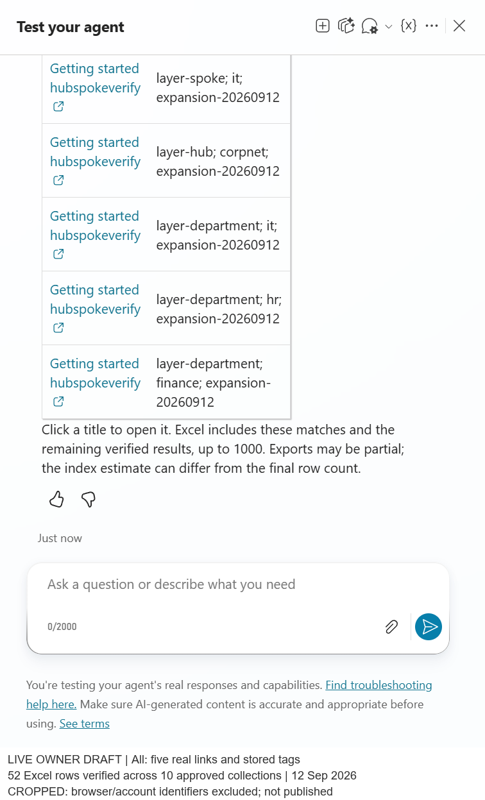

# SharePoint Search Hub

**One Copilot Studio agent. Multiple approved SharePoint sites. Source-linked results and a private Excel export.**

SharePoint Search Hub is a reference implementation for searching a corporate
hub-and-spoke estate without creating a separate agent for every department.
The agent guides the user through a scope and keyword search, shows a compact
preview with real source links and stored tags, and continues the same request
into a filterable workbook delivered through the selected account's mailbox.

> **Private preview, prepared for future public review.**
> This repository contains publication-safe reference source, not a
> tenant-connected solution export or a production-ready release. Keep it
> private until the [public-release checklist](docs/public-release-checklist.md)
> is complete. GitHub Pages is not enabled.

## What it does

| Capability | Behavior |
|---|---|
| Guided search | Select `All`, `CorpNet`, `HR`, `Finance`, or `IT`, then supply plain search words or `*`. |
| Hub-and-spoke coverage | Search an explicit inventory of approved site collections, including multiple sites in one department. A hub URL alone is not automatic discovery. |
| Files and pages | Retrieve matching documents and SharePoint pages, subject to indexing, current access and configured bounds. |
| Useful chat preview | Show up to five verified links with their actual stored `TopicTags`. Missing tags are not invented. |
| Private workbook | Continue into a genuine Excel table containing verified exported rows, source links and metadata, including the previewed rows when they remain accessible. |
| Verified-account delivery | Use caller-provided connectors and the verified profile's mailbox, not an email address supplied in chat. |
| Honest outcomes | Distinguish an index estimate, displayed results, export started, completed rows, partial completion and the email action. |

This is a **controlled search-and-export experience**, not a general-purpose
policy-answering bot. It does not synthesize company policy from the model's
general knowledge or fall back to an unrestricted web search.

## Architecture at a glance

[Architecture and trust boundaries](docs/architecture.md) ·
[Example prompts and outputs](docs/examples.md) ·
[Setup and adaptation](docs/setup.md) ·
[Evidence and limitations](docs/validation.md)

## Quick demonstration

Start with **`Search SharePoint`**, choose **`HR`**, then enter **`leave`**.
Use **`All`** and **`*`** to exercise the configured cross-site search rather
than only the corporate hub.

The chat presents a small result preview; the workbook is the place for the
larger result set. It must not claim an email was sent merely because the flow
returned an initial response.

The [examples guide](docs/examples.md) separates observed demonstration
behavior from illustrative output. Counts are snapshots, not fixed values for
another tenant.

## Real product screenshots

**Verified owner-account draft, 12 September 2026.** The `All` /
`hubspokeverify` conversation exported and read back **52/52 expected rows
across ten collections**. An HR-only conversation verified **16/16 rows across
three HR collections**. Both showed five linked results in two columns and
completed private workbook/email actions. Browser and account identifiers were
cropped out.

[View all screenshots, including the clearly labeled historical baseline](docs/screenshots.md).
These are genuine captures, not mockups. This is owner-only draft evidence,
not non-owner permission, published-channel or greater-than-100-row paging proof.

## Repository guide

| Area | Purpose |
|---|---|
| [`agent/`](agent/) | Portable agent/source reference and component-specific instructions. |
| [`docs/architecture.md`](docs/architecture.md) | Components, request lifecycle, identity boundaries and search semantics. |
| [`docs/examples.md`](docs/examples.md) | Guided prompts, output shapes and negative-path examples. |
| [`docs/screenshots.md`](docs/screenshots.md) | Genuine cropped chat, native-tool binding and topic-response captures, with their evidence limits. |
| [`docs/setup.md`](docs/setup.md) | Environment preparation and safe adaptation to a different tenant. |
| [`docs/validation.md`](docs/validation.md) | What was observed, what remains unproven and how to repeat the checks. |
| [`docs/public-release-checklist.md`](docs/public-release-checklist.md) | Review gates before changing visibility or enabling a public site. |

## Important boundaries

- A department is a relevance filter, **not an authorization boundary**.
- The selected authenticated connector account is the effective identity. It
  is not assumed to be identical to the chat channel's sign-in account.
- Runtime SharePoint, profile, OneDrive, Excel and email connections remain
  **provided by the invoking user**. Provisioning credentials are not a
  search fallback.
- `TopicTags` is a semicolon-delimited text column, not managed taxonomy.
  Displaying stored tags does not mean tag filtering is implemented.
- `PolicyStatus` is not selected, exported or filtered. Draft and archived
  documents can be returned; this is not an approved-policy-only search.
- Search indexing is eventually consistent. Newly published content can be
  present in SharePoint before it appears in search.
- The implementation has explicit row, candidate, page and site-batch limits.
  A capped or failed export must not be described as complete.
- Owner-account demonstration evidence is not a non-owner permission-denial
  test, a 150-site performance result or a SharePoint-channel rollout.

All demonstration policies and facts are fictional. There is no open-source
license grant yet; licensing is a deliberate public-release decision.
