# SharePoint Search Hub

**One Copilot Studio agent. Multiple approved SharePoint sites. Source-linked results and a private Excel export.**

SharePoint Search Hub is a reference implementation for searching a corporate
hub-and-spoke estate without creating a separate agent for every department.
The agent guides the user through a scope and keyword search, shows a compact
preview with real source links, source dates and stored tags, and continues the same request
into a filterable workbook delivered through the selected account's mailbox.

> **Private preview, prepared for future public review.**
> This repository contains publication-safe reference source, not a
> tenant-connected solution export or a production-ready release. Keep it
> private until the [public-release checklist](docs/public-release-checklist.md)
> is complete. GitHub Pages is not enabled.

## What it does

| Capability | Behavior |
|---|---|
| Guided search | Select `All`, `CorpNet`, `HR`, `Finance`, or `IT`, then supply plain search words or `*`. |
| Hub-and-spoke coverage | Search an explicit inventory of approved site collections, including multiple sites in one department. A hub URL alone is not automatic discovery. |
| Files and pages | Retrieve matching documents and SharePoint pages, subject to indexing, current access and configured bounds. |
| Useful chat preview | Show up to ten verified rows in four separate columns: linked file/page, Created (UTC), Modified (UTC), and stored tags. Missing metadata is not invented. |
| Private workbook | Continue into a genuine Excel table containing verified exported rows, source links and metadata, including the previewed rows when they remain accessible. |
| Verified-account delivery | Use caller-provided connectors and the verified profile's mailbox, not an email address supplied in chat. |
| Honest outcomes | Distinguish an index estimate, displayed results, export started, completed rows, partial completion and the email action. |

The current source adds a compact workbook with top-aligned rows, readable
calendar dates, full timestamps retained in hidden columns, and an actual
scope/query/completion summary. The chat now uses a clearer heading, compact
scope/index summary and a distinct **export started / delivery pending**
callout while retaining the four-column table and honest completion caveats.
Ten preview rows are selected through bounded
retrieval, not a guarantee of a globally ranked top ten across the estate.
Historical screenshots retain their original five-row presentation; current
four-column captures explicitly show the narrow-pane wrapping limitation.

This is a **controlled search-and-export experience**, not a general-purpose
policy-answering bot. It does not synthesize company policy from the model's
general knowledge or fall back to an unrestricted web search.

## Architecture at a glance

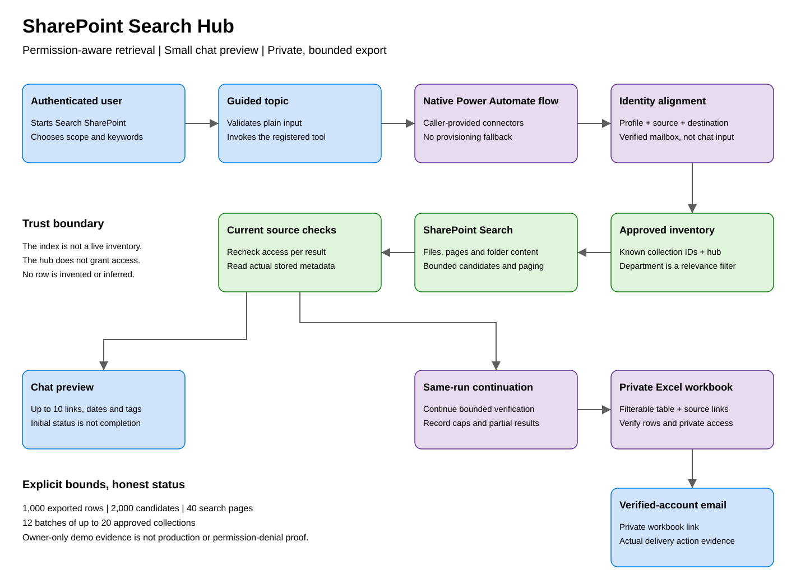

[Architecture and trust boundaries](docs/architecture.md) ·
[Step-by-step agent and flow walkthrough](docs/flow-walkthrough.md) ·
[Example prompts and outputs](docs/examples.md) ·
[Setup and adaptation](docs/setup.md) ·
[Evidence and limitations](docs/validation.md)

## Quick demonstration

Start with **`Search SharePoint`**, choose **`HR`**, then enter **`leave`**.
Use **`annual leave`** to reproduce the owner's page-and-document example.
Use **`All`** and **`*`** to exercise the configured cross-site search rather
than only the corporate hub.

The chat presents a small result preview; the workbook is the place for the
larger result set. It must not claim an email was sent merely because the flow
returned an initial response.

The [examples guide](docs/examples.md) separates observed demonstration
behavior from illustrative output. Counts are snapshots, not fixed values for
another tenant.

The [flow walkthrough](docs/flow-walkthrough.md) follows the actual named actions
from `Valid_input` and `Initial_search` through `Respond_to_agent`, `Export_rows`
and `Send_private_workbook`, including the source checks and completion gates.

## Real product screenshots

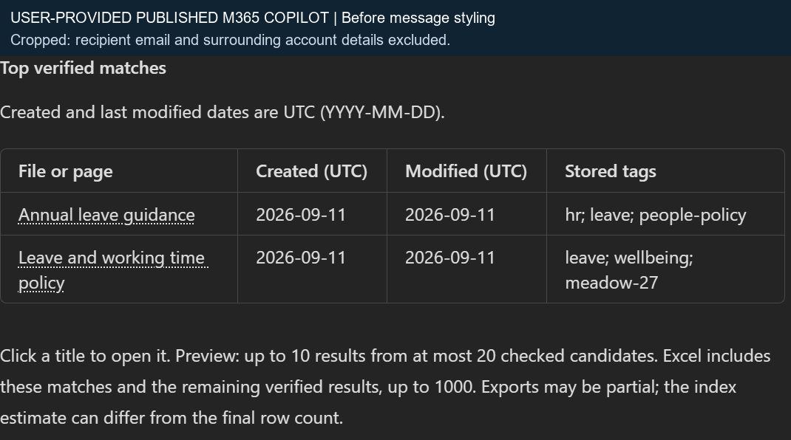

**Published M365 Copilot, supplied by the owner.** The reported HR /
`annual leave` search displays one page and one Word document. The four-column
table renders clearly in this wider client. This capture predates the styling
refinement; the recipient email was removed by cropping. It is visual evidence,
not a separate audit of published-channel authentication or delivery.

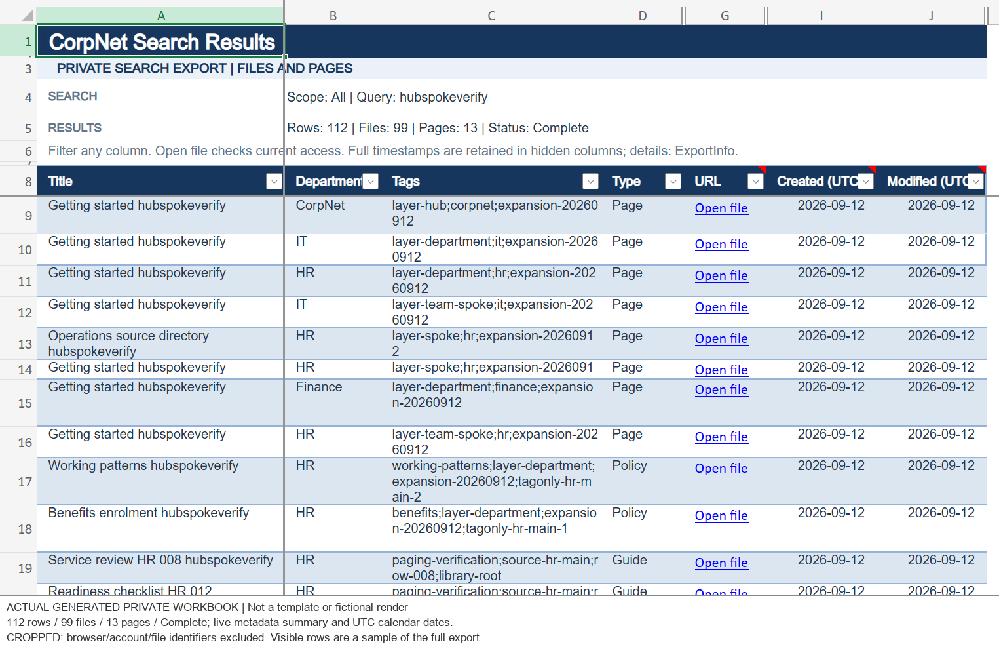

**Verified owner-account draft, 12 September 2026.** The final four-column
`All` / `hubspokeverify` conversation passed **45 functional checks**, including
ten linked/date-bearing rows, actual **100 + 12 search pages**, and **112 exact
Excel rows across ten collections**. All ten preview links were included;
224 source timestamps/calendar values, private ACL and email acceptance matched.

The actual workbook capture above comes from the preceding run using the
identical template. **Current four-column chat headers and dates wrap severely
in the narrow Studio pane**; this is not polished narrow-client or Teams proof.
Browser and account identifiers are cropped out.

[View all screenshots, including the clearly labeled historical baseline](docs/screenshots.md).
These are genuine captures, not mockups. Draft runtime evidence and the
owner-provided published visual are labelled separately; neither establishes
non-owner permissions, published-channel delivery or production-scale readiness.

## Captured inputs, output and agent flow

The styled **HR / annual leave** conversation returned one SharePoint page and
one Word document, verified both Excel rows and their source dates, and completed
the private-delivery checks. These are actual Studio captures from that run,
not reconstructed UI. M365 requested account selection in the automation browser,
so no fresh published-channel execution is claimed.

**Area and query input**

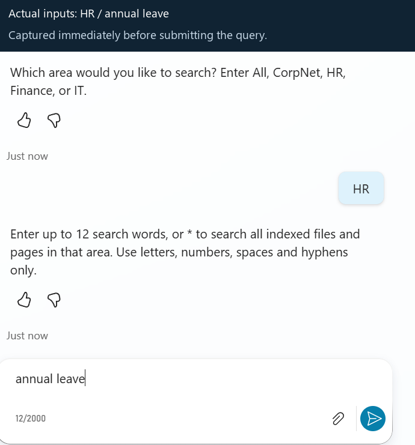

**Styled result excerpt**

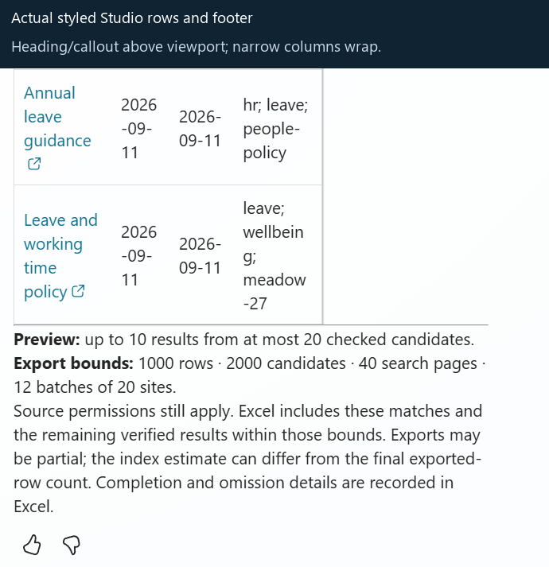

The heading and delivery-pending callout were verified in the actual returned
bot message but are above this captured viewport. The narrow Studio columns
still wrap. [Message example and styling](docs/examples.md#chat-output-shape)
is explicitly illustrative, not a substitute screenshot.

**Topic-to-flow inputs and result binding**

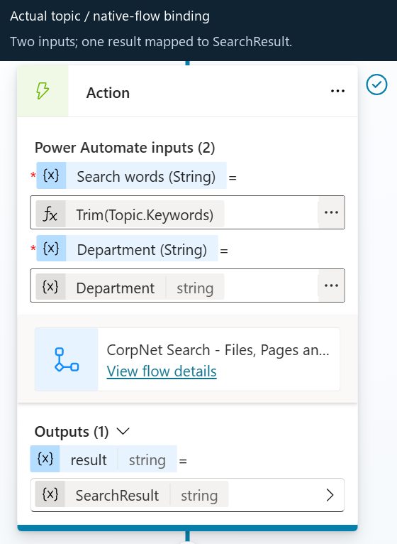

**Agent response followed by the same-run private export**

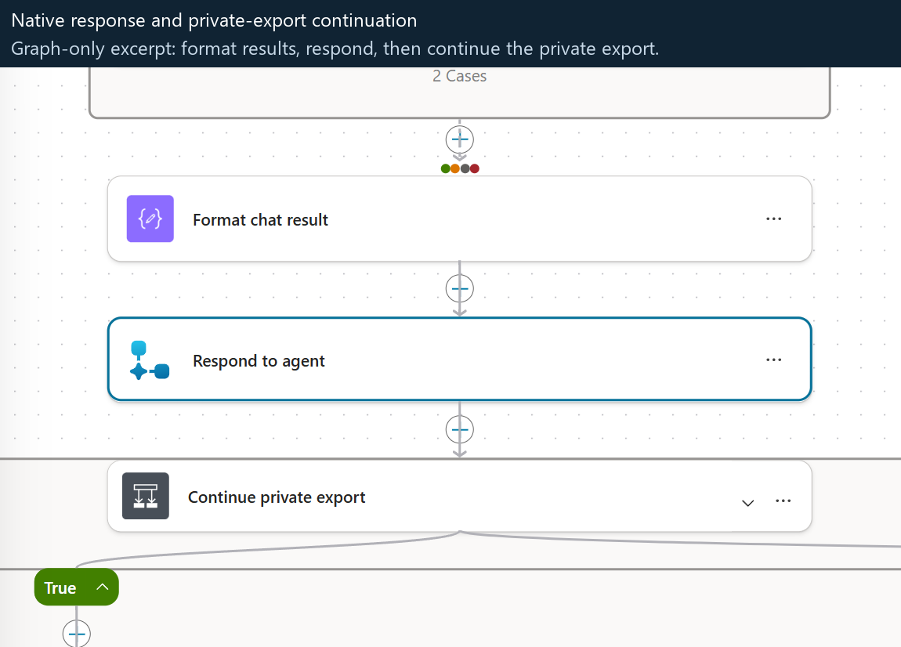

[Complete flow definition](agent/flows/search-export/definition.json) ·
[Flow builder](agent/scripts/build-search-export-flow.py) ·
[Stage-by-stage walkthrough](docs/flow-walkthrough.md) ·
[Runtime result](docs/styled-validation-summary.json)

More genuine input and native-flow screenshots

**Entrypoint and trigger**

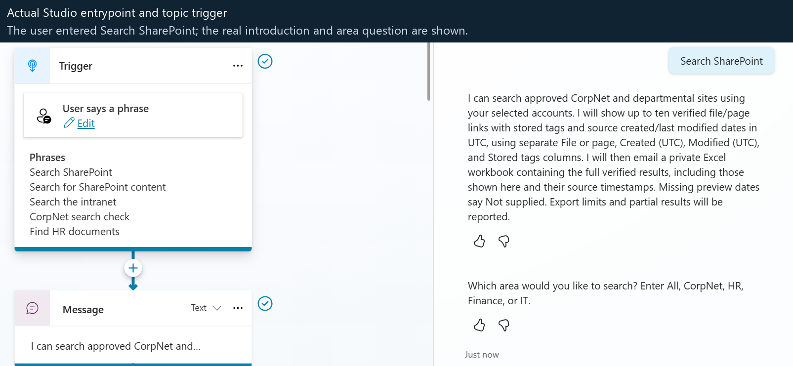

**Flow overview and observed run history**

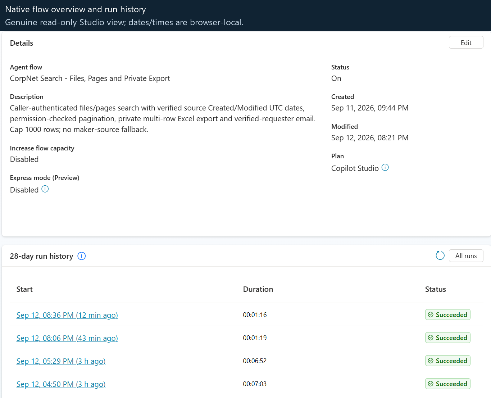

**Native agent-call trigger and initialization**

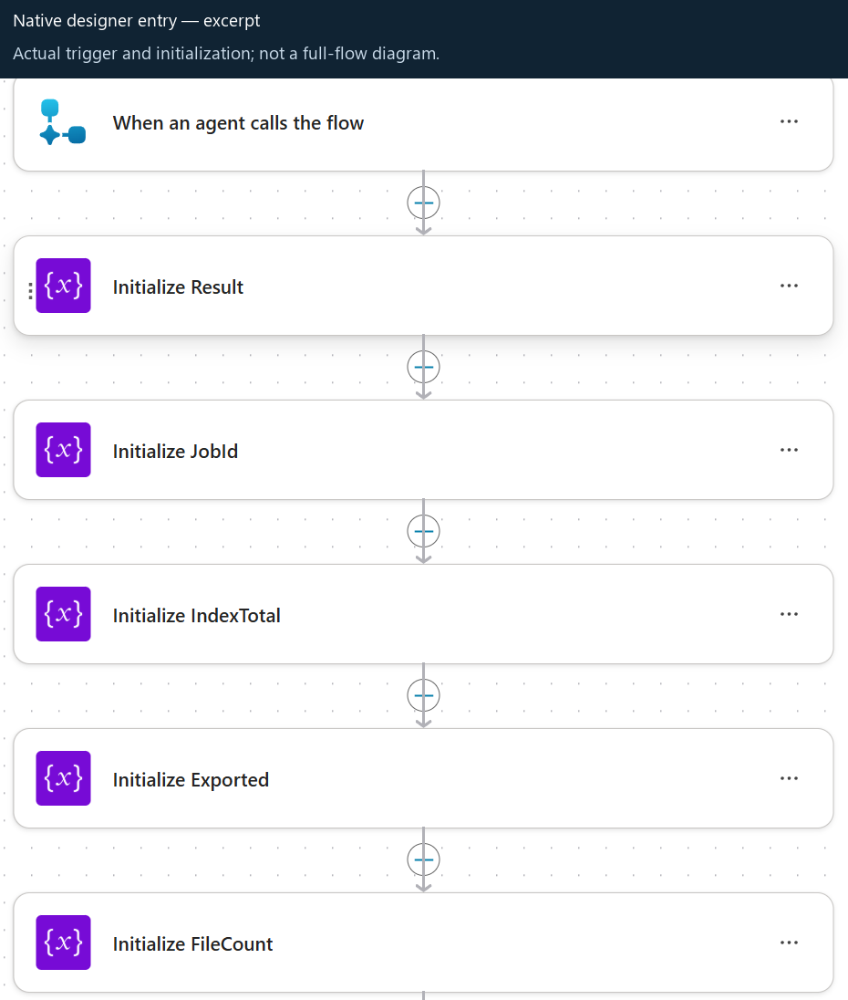

**Initial search: RowLimit 100, StartRow 0**

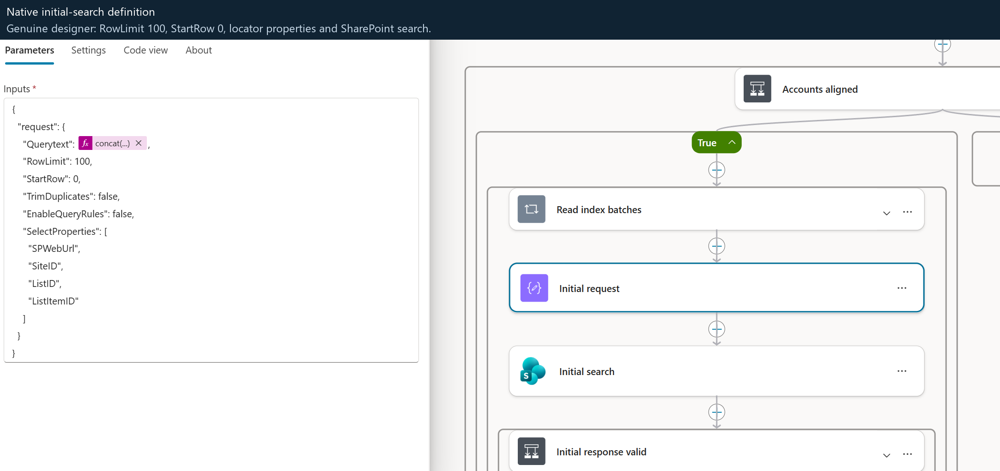

**Next-page request: unchanged RowLimit, advancing PageStart**

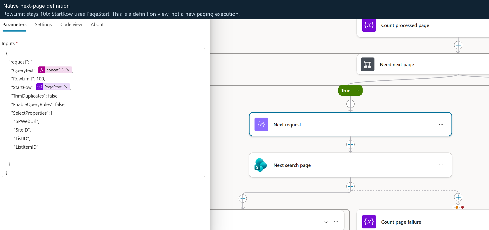

**Current-source metadata hydration**

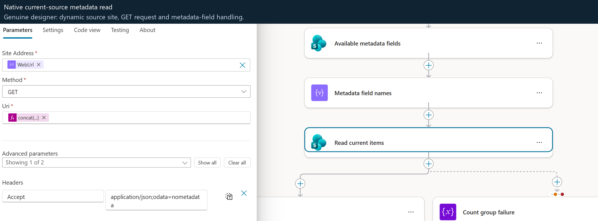

**Append verified rows to the private Excel table**

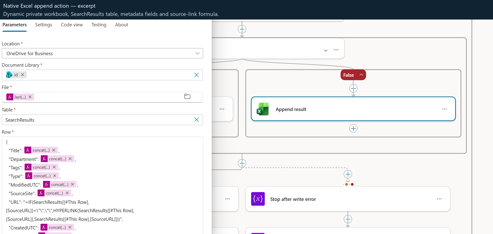

**Final destination-access gate**

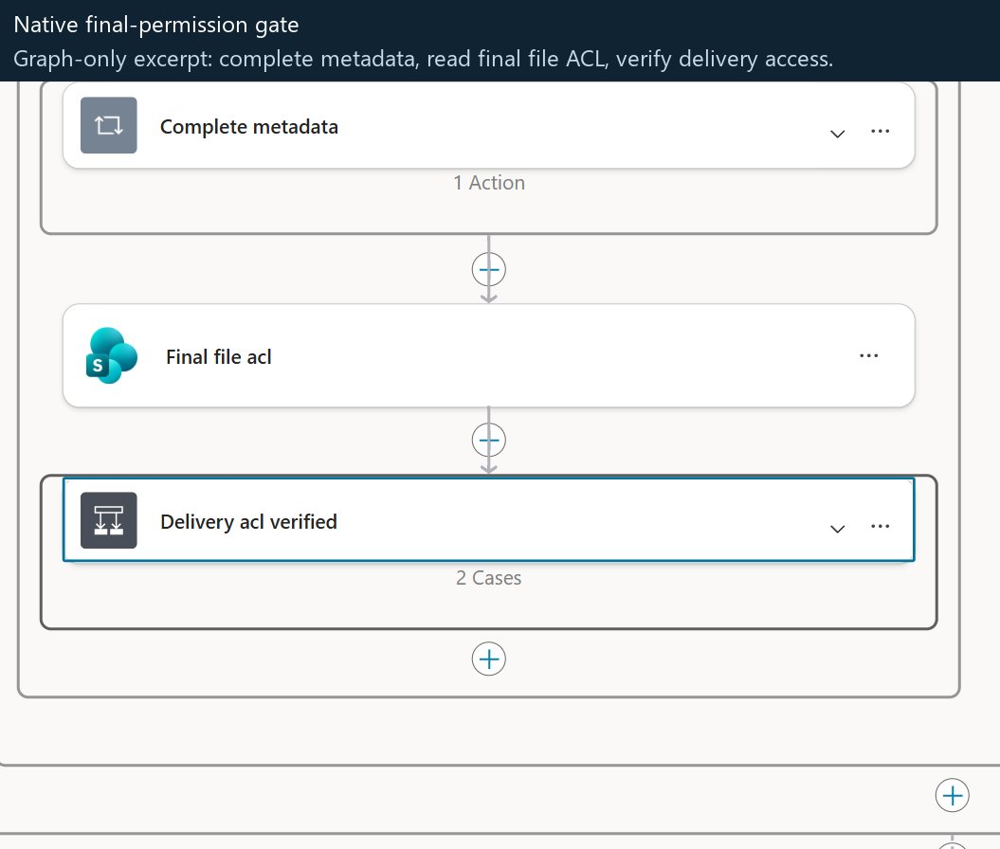

**Verified-profile recipient after the access gate**

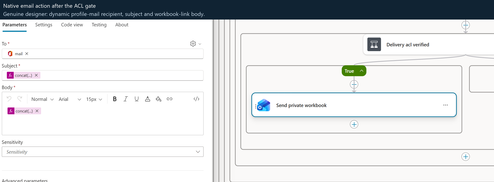

These are partial designer views, not a full-flow image or a new pagination
execution. Some expression-backed conditions do not populate modern Parameters
controls faithfully; no designer values were edited or saved. The complete
JSON and runtime evidence, not blank/default UI controls, establish the actual
definition and execution. Captions and [provenance](docs/styled-capture-provenance.json)
record the crop boundaries.

## Repository guide

| Area | Purpose |
|---|---|
| [`agent/`](agent/) | Portable agent/source reference and component-specific instructions. |
| [`agent/topics/SearchSharePoint.mcs.yml`](agent/topics/SearchSharePoint.mcs.yml) | Actual guided input and native-flow invocation source. |
| [`agent/actions/SearchAndExport.mcs.yml`](agent/actions/SearchAndExport.mcs.yml) | Portable native-tool binding and caller-authentication contract. |
| [`agent/flows/search-export/definition.json`](agent/flows/search-export/definition.json) | Complete generated native agent-flow definition. |
| [`agent/scripts/build-search-export-flow.py`](agent/scripts/build-search-export-flow.py) | Maintainable builder for the search, preview, paging, private export and delivery flow. |
| [`docs/flow-walkthrough.md`](docs/flow-walkthrough.md) | Inputs, named flow stages, current-source checks, workbook schema, limits and delivery behaviour. |
| [`docs/architecture.md`](docs/architecture.md) | Components, request lifecycle, identity boundaries and search semantics. |
| [`docs/examples.md`](docs/examples.md) | Guided prompts, output shapes and negative-path examples. |
| [`docs/screenshots.md`](docs/screenshots.md) | Genuine cropped chat, native-tool binding and topic-response captures, with their evidence limits. |
| [`docs/setup.md`](docs/setup.md) | Environment preparation and safe adaptation to a different tenant. |
| [`docs/validation.md`](docs/validation.md) | What was observed, what remains unproven and how to repeat the checks. |
| [`docs/public-release-checklist.md`](docs/public-release-checklist.md) | Review gates before changing visibility or enabling a public site. |

## Department banners

The banner enhancement uses a **context-only Adaptive Card** followed by the
existing native four-column results table. The table is not squeezed into a
narrower card. HR, IT, Finance, All and CorpNet have different original artwork:

[All](agent/cards/assets/All.png) · [CorpNet](agent/cards/assets/CorpNet.png) ·
[Finance](agent/cards/assets/Finance.png) · [Banner source and host limits](agent/cards/README.md)

These are source assets, **not proof of published-channel rendering**. The card
uses a separately labelled, unmodified Microsoft SharePoint product icon to
identify the integration, not as the agent's logo. The original banners contain
no Microsoft logos; [asset rights and provenance](agent/cards/NOTICE.md) apply.

Inline PNGs avoid external image hosting or permission changes. Each complete
context card is below a 12,000-byte budget and contains no result rows or actions.
The card does not claim search/export success; the unchanged result message
provides the actual outcome. This enhancement changes the topic's presentation,
not the flow contract. Owners control when the draft is published.

**Draft status:** the one-node change is deployed and loaded without topic
errors or warnings. Studio's card editor rendered HR/IT artwork and the icon;
this is not published-channel proof. The owner reported republishing the draft
on 12 September 2026; actual channel rendering is checked separately.
[Actual designer capture and limits](docs/screenshots.md#department-banner-designer).

## Important boundaries

- A department is a relevance filter, **not an authorization boundary**.
- The selected authenticated connector account is the effective identity. It
  is not assumed to be identical to the chat channel's sign-in account.
- Runtime SharePoint, profile, OneDrive, Excel and email connections remain
  **provided by the invoking user**. Provisioning credentials are not a
  search fallback.
- `TopicTags` is a semicolon-delimited text column, not managed taxonomy.
  Displaying stored tags does not mean tag filtering is implemented.
- `PolicyStatus` is not selected, exported or filtered. Draft and archived
  documents can be returned; this is not an approved-policy-only search.
- Search indexing is eventually consistent. Newly published content can be
  present in SharePoint before it appears in search.
- The implementation has explicit row, candidate, page and site-batch limits.
  A capped or failed export must not be described as complete.
- Owner-account demonstration evidence is not a non-owner permission-denial
  test, a 150-site performance result or a SharePoint-channel rollout.

All demonstration policies and facts are fictional. There is no open-source
license grant yet; licensing is a deliberate public-release decision.
