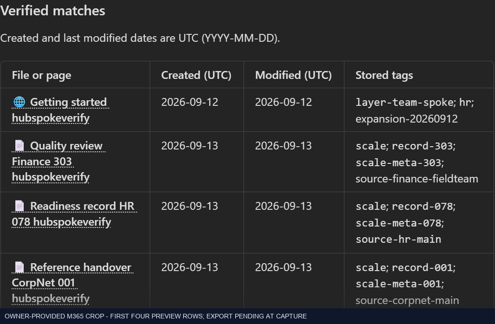
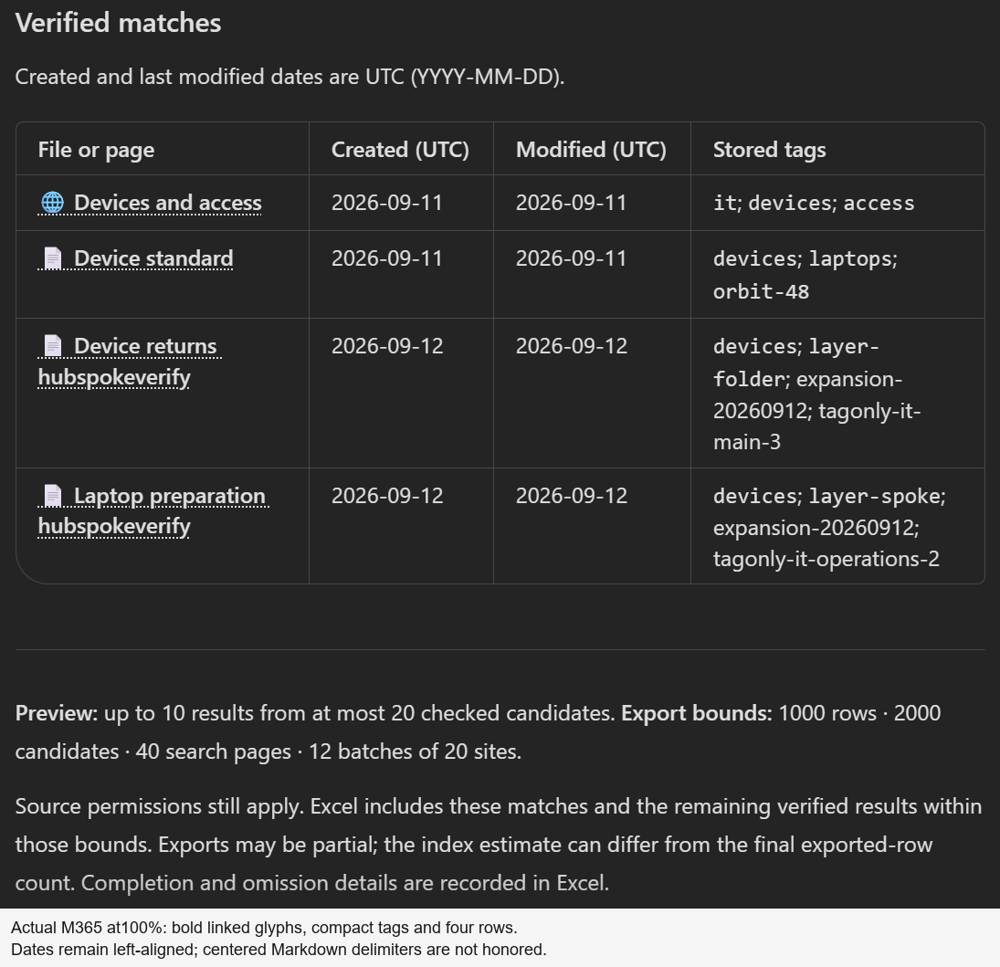
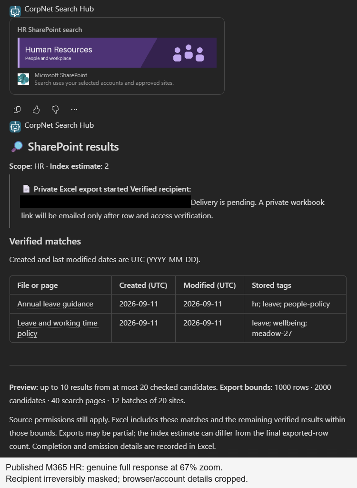
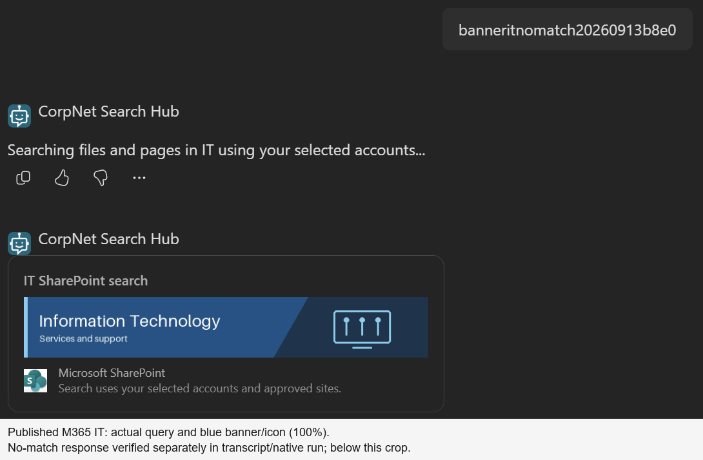

# SharePoint Search Hub

**One Copilot Studio agent. Multiple approved SharePoint sites. Source-linked results and a private Excel export.**

SharePoint Search Hub is a reference implementation for searching a corporate
hub-and-spoke estate without creating a separate agent for every department.
The agent guides the user through a scope and keyword search, shows a compact
preview with real source links, source dates and stored tags, and continues the same request
into a filterable workbook delivered through the selected account's mailbox.

> **Public reference implementation, not a production-ready release.**
> This repository contains portable source, a synthetic test corpus and an
> unmanaged reference solution—not live tenant connections. Explore the
> **[project website](https://ryanbowie.github.io/copilot-studio-sharepoint-search-hub/)**,
> [publication review and remaining deployment checks](docs/public-release-checklist.md)
> and [rights notice](NOTICE.md). A successful demo is not a new-tenant import
> or non-owner authorization certification.

## What it does

| Capability | Behavior |
|---|---|
| Guided search | Select `All`, `CorpNet`, `HR`, `Finance`, or `IT`, then supply plain search words or `*`. |
| Hub-and-spoke coverage | Search an explicit inventory of approved site collections, including multiple sites in one department. A hub URL alone is not automatic discovery. |
| Files and pages | Retrieve matching documents and SharePoint pages, subject to indexing, current access and configured bounds. |
| Useful chat preview | Show up to ten verified rows in four separate columns: linked file/page, Created (UTC), Modified (UTC), and stored tags. Missing metadata is not invented. |
| Private workbook | Continue into a genuine Excel table containing verified exported rows, source links and metadata, including the previewed rows when they remain accessible. |
| Verified-account delivery | Use caller-provided connectors and the verified profile's mailbox, not an email address supplied in chat. |
| Honest outcomes | Distinguish an index estimate, displayed results, export started, completed rows, partial completion and the email action. |

The current source adds a compact workbook with top-aligned rows, readable
calendar dates, full timestamps retained in hidden columns, and an actual
scope/query/completion summary. The chat now uses a clearer heading, compact
scope/index summary and a distinct **export started / delivery pending**
callout while retaining the four-column table and honest completion caveats.
The table formatter adds **bold source links with file/page glyphs**, centered
date-column markers and compact code-styled labels for short, safe tags.
Long or unsafe labels remain escaped wrapping text; tags are not discarded.
M365/Teams controls the grid's colors, fonts and borders.
The actual M365 host renders the new bold glyph links and monospace tag labels,
but **ignores the centering markers: dates remain left-aligned**.
The stable-paging revision orders initial and subsequent search pages by
document ID ascending within each approved site batch. The preview is up to
ten verified matches from that bounded traversal—not a relevance-ranked best ten.
Historical screenshots retain their original five-row presentation; current
four-column captures explicitly show the narrow-pane wrapping limitation.

This is a **controlled search-and-export experience**, not a general-purpose
policy-answering bot. It does not synthesize company policy from the model's
general knowledge or fall back to an unrestricted web search.

## Architecture at a glance


[Architecture and trust boundaries](docs/architecture.md) ·
[Step-by-step agent and flow walkthrough](docs/flow-walkthrough.md) ·
[Example prompts and outputs](docs/examples.md) ·
[Setup and adaptation](docs/setup.md) ·
[Evidence and limitations](docs/validation.md)

## Agent solution and new-tenant customization

**[Download the unmanaged agent solution](solutions/CorpNetSearchHubReference_1_0_0_0_unmanaged.zip)**

This is a real Power Platform solution package containing the agent, 16 active
bot components, the native search/export flow, five connection references,
blank workbook and banners. Complete unpacked source and an offline rebuild
script are included under [`solutions/`](solutions/).

**HR, IT, Finance and CorpNet are test departments, not universal business
configuration.** A new tenant requires coordinated customization of scopes,
topics, instructions, banner mappings, SharePoint sites/hub IDs, metadata,
connections, authentication and model availability. The package starts with
four fictional Contoso site references, empty connection bindings, no channels,
no automatic publication and a stopped workflow.

**New-tenant import/runtime remain unverified.** PAC packing, 13 package tests
and a 39-file semantic roundtrip are not proof of successful import or target
permissions. Use an isolated development environment and the
[solution setup guide](solutions/README.md); do not import it back over the
original demonstration agent without a separate upgrade plan.

The SharePoint corpus is separate from the solution. The
[512-item fixture blueprint](fixtures/corpnet-demo/scale-expected-results.example.json)
and [generator](fixtures/corpnet-demo/README.md#500-plus-scale-fixture) define
499 documents and 13 pages across ten collection targets. Creating, indexing
and actually retrieving those items are separate checks. The connected source
deployment has now passed the [full 512-row native export check](docs/validation.md#512-result-native-export---13-september-2026);
that does not establish import or runtime success for the fictional reference ZIP.

## Quick demonstration

Start with **`Search SharePoint`**, choose **`HR`**, then enter **`leave`**.
Use **`annual leave`** to reproduce the owner's page-and-document example.
Use **`All`** and **`*`** to exercise the configured cross-site search rather
than only the corporate hub.

The chat presents a small result preview; the workbook is the place for the
larger result set. It must not claim an email was sent merely because the flow
returned an initial response.

The [examples guide](docs/examples.md) separates observed demonstration
behavior from illustrative output. Counts are snapshots, not fixed values for
another tenant.

The [flow walkthrough](docs/flow-walkthrough.md) follows the actual named actions
from `Valid_input` and `Initial_search` through `Respond_to_agent`, `Export_rows`
and `Send_private_workbook`, including the source checks and completion gates.

## 512-item search in published M365




The owner supplied this published M365 screenshot on 13 September 2026.
It shows the **512-match index estimate** and a cross-department preview with
page/file glyphs, linked titles, UTC dates and stored tags. The private export
had started, but delivery was still pending at capture.

**This is not proof of 512 completed Excel rows.** The header and four-row
excerpt are separate crops of one real screenshot, not a stitched full result.
The account/recipient block is excluded; browser zoom was not independently
verified.

**The same owner-started run subsequently completed all 512 Excel rows in
26m46s.** Read-only verification confirmed six disjoint source pages, all 512
caller-hydrated sources, exact workbook readback and final owner-private access.
No rows were omitted or duplicated. One verified-profile email was accepted;
inbox receipt was not independently checked. The screenshot remains a
pending-export capture, not a picture of the completed workbook.

[Screenshot context and limits](docs/screenshots.md#owner-provided-512-item-preview) ·
[Capture provenance](docs/scale-512-capture-provenance.json) ·
[Source/index evidence](docs/scale-source-validation-summary.json) ·
[Completed native export evidence](docs/scale-runtime-validation-summary.json)

## Updated table in published M365



The actual **IT / devices** conversation returned **four verified results:
one SharePoint page and three documents**. All four rows and their stored tags
are visible. The page/file glyph stays inside the bold source link; short safe
tags use monospace styling, while long tags remain normal wrapping text.
They are not custom-colored tag pills.

The same request verified four private Excel rows, their source dates and one
accepted verified-recipient email. **M365 keeps dates left-aligned despite the
Markdown centering markers.** That host limitation is documented, not counted
as a passed visual check. No additional agent republish was needed.

[Actual input](docs/images/table-polish/published-m365-it-devices-inputs.png) ·
[Owner-provided earlier table](docs/images/table-polish/owner-before.png) ·
[Runtime evidence and limits](docs/table-polish-validation-summary.json) ·
[Capture provenance](docs/table-polish-capture-provenance.json)

## Published M365 banners and results

After the owner republished the draft, actual M365 Copilot conversations
rendered the **purple HR and blue IT banners with the SharePoint icon**.
HR / `annual leave` returned one page and one document, verified both private
Excel rows and accepted one verified-recipient email. IT's unique no-match
query returned no results and skipped workbook/email writes.



This genuine full-output capture uses **67% browser zoom** to fit the banner,
heading, pending-delivery callout, two-row table and footer. It is not a
composite. The [100% table crop](docs/images/published-m365/published-m365-hr-table-100.png)
shows readable separate dates. These captures precede table-specific polish;
the table here still uses ordinary native Markdown styling.



IT's no-match message is below this crop and was verified separately in the
actual transcript and native run. Browser zoom was restored to 100%.
[Actual inputs and capture gallery](docs/screenshots.md#published-m365-banner-runtime) ·
[Runtime summary](docs/m365-validation-summary.json) ·
[Capture provenance](docs/m365-capture-provenance.json)

This is owner-account M365 evidence, not Teams, non-owner permissions,
inbox receipt or a new greater-than-100 paging test.

## Real product screenshots


**Published M365 Copilot, supplied by the owner.** The reported HR /
`annual leave` search displays one page and one Word document. The four-column
table renders clearly in this wider client. This capture predates the styling
refinement; the recipient email was removed by cropping. It is visual evidence,
not a separate audit of published-channel authentication or delivery.


**Verified owner-account draft, 12 September 2026.** The final four-column
`All` / `hubspokeverify` conversation passed **45 functional checks**, including
ten linked/date-bearing rows, actual **100 + 12 search pages**, and **112 exact
Excel rows across ten collections**. All ten preview links were included;
224 source timestamps/calendar values, private ACL and email acceptance matched.

The actual workbook capture above comes from the preceding run using the
identical template. **Current four-column chat headers and dates wrap severely
in the narrow Studio pane**; this is not polished narrow-client or Teams proof.
Browser and account identifiers are cropped out.

[View all screenshots, including the clearly labeled historical baseline](docs/screenshots.md).
These are genuine captures, not mockups. Draft runtime evidence and the
owner-provided published visual are labelled separately; neither establishes
non-owner permissions, published-channel delivery or production-scale readiness.

## Captured inputs, output and agent flow

The styled **HR / annual leave** conversation returned one SharePoint page and
one Word document, verified both Excel rows and their source dates, and completed
the private-delivery checks. These are actual Studio captures from that run,
not reconstructed UI. M365 requested account selection in the automation browser,
so no fresh published-channel execution is claimed.

**Area and query input**


**Styled result excerpt**


The heading and delivery-pending callout were verified in the actual returned
bot message but are above this captured viewport. The narrow Studio columns
still wrap. [Message example and styling](docs/examples.md#chat-output-shape)
is explicitly illustrative, not a substitute screenshot.

**Topic-to-flow inputs and result binding**


**Agent response followed by the same-run private export**


[Complete flow definition](agent/flows/search-export/definition.json) ·
[Flow builder](agent/scripts/build-search-export-flow.py) ·
[Stage-by-stage walkthrough](docs/flow-walkthrough.md) ·
[Runtime result](docs/styled-validation-summary.json)

<details>
<summary>More genuine input and native-flow screenshots</summary>

**Entrypoint and trigger**


**Flow overview and observed run history**


**Native agent-call trigger and initialization**


**Initial search: RowLimit 100, StartRow 0**


**Next-page request: unchanged RowLimit, advancing PageStart**


**Current-source metadata hydration**


**Append verified rows to the private Excel table**


**Final destination-access gate**


**Verified-profile recipient after the access gate**


These are partial designer views, not a full-flow image or a new pagination
execution. Some expression-backed conditions do not populate modern Parameters
controls faithfully; no designer values were edited or saved. The complete
JSON and runtime evidence, not blank/default UI controls, establish the actual
definition and execution. Captions and [provenance](docs/styled-capture-provenance.json)
record the crop boundaries.

</details>

## Repository guide

| Area | Purpose |
|---|---|
| [`agent/`](agent/) | Portable agent/source reference and component-specific instructions. |
| [`solutions/`](solutions/) | Actual unmanaged reference ZIP, complete unpacked source, unbound settings and customization/validation guidance. |
| [`fixtures/corpnet-demo/`](fixtures/corpnet-demo/) | Reproducible 512-item common-marker blueprint and synthetic DOCX/page generators; not a runtime data feed. |
| [`agent/topics/SearchSharePoint.mcs.yml`](agent/topics/SearchSharePoint.mcs.yml) | Actual guided input and native-flow invocation source. |
| [`agent/actions/SearchAndExport.mcs.yml`](agent/actions/SearchAndExport.mcs.yml) | Portable native-tool binding and caller-authentication contract. |
| [`agent/flows/search-export/definition.json`](agent/flows/search-export/definition.json) | Complete generated native agent-flow definition. |
| [`agent/scripts/build-search-export-flow.py`](agent/scripts/build-search-export-flow.py) | Maintainable builder for the search, preview, paging, private export and delivery flow. |
| [`agent/flows/search-export/formatting.md`](agent/flows/search-export/formatting.md) | Native table styling, verified glyph source, bounded tag labels and rendering limits. |
| [`docs/flow-walkthrough.md`](docs/flow-walkthrough.md) | Inputs, named flow stages, current-source checks, workbook schema, limits and delivery behaviour. |
| [`docs/architecture.md`](docs/architecture.md) | Components, request lifecycle, identity boundaries and search semantics. |
| [`docs/examples.md`](docs/examples.md) | Guided prompts, output shapes and negative-path examples. |
| [`docs/screenshots.md`](docs/screenshots.md) | Genuine cropped chat, native-tool binding and topic-response captures, with their evidence limits. |
| [`docs/setup.md`](docs/setup.md) | Environment preparation and safe adaptation to a different tenant. |
| [`docs/validation.md`](docs/validation.md) | What was observed, what remains unproven and how to repeat the checks. |
| [`docs/public-release-checklist.md`](docs/public-release-checklist.md) | Review gates before changing visibility or enabling a public site. |
| [`site/`](site/) and [`scripts/build_site.py`](scripts/build_site.py) | Static website template, dependency-free build/tests and isolated local preview. |

## Website development and deployment

From the repository root, with Python 3.10 or later:

```powershell
python -B scripts\build_site.py
python -B -m unittest discover -s site\tests -v
python -B site\preview.py --port 8765
```

Open the loopback URL printed by the preview command. The builder generates
`docs/index.html` and stages only the explicit public-file allowlist in `_site`.
It copies the reviewed solution bytes; it never regenerates the agent, connects
to Microsoft 365, submits a search or sends email. The page has no analytics,
external scripts or font service; architecture/gallery controls explain the
implementation rather than execute it.

Pages uses GitHub Actions. After pushing a reviewed update, run
**Build and deploy reference Pages** manually from the **Actions** tab on `main`.
The [workflow](.github/workflows/pages.yml) intentionally does not change Pages
settings or repository visibility, and only deploys `_site`. Official actions
are pinned to commit hashes; only the deployment job has Pages write and
identity-token permissions. Optional browser checks in `site/smoke_browser.py`
use Playwright and a new isolated headless Edge profile, not a signed-in browser.

## Department banners

The banner enhancement uses a **context-only Adaptive Card** followed by the
existing native four-column results table. The table is not squeezed into a
narrower card. HR, IT, Finance, All and CorpNet have different original artwork:


[All](agent/cards/assets/All.png) · [CorpNet](agent/cards/assets/CorpNet.png) ·
[Finance](agent/cards/assets/Finance.png) · [Banner source and host limits](agent/cards/README.md)

These are source assets, **not proof of published-channel rendering**. The card
uses a separately labelled, unmodified Microsoft SharePoint product icon to
identify the integration, not as the agent's logo. The original banners contain
no Microsoft logos; [asset rights and provenance](agent/cards/NOTICE.md) apply.

Inline PNGs avoid external image hosting or permission changes. Each complete
context card is below a 12,000-byte budget and contains no result rows or actions.
The card does not claim search/export success; the unchanged result message
provides the actual outcome. This enhancement changes the topic's presentation,
not the flow contract. Owners control when the draft is published.

**Draft status:** the one-node change is deployed and loaded without topic
errors or warnings. Studio's card editor rendered HR/IT artwork and the icon;
the owner then republished it, and separate M365 runtime checks verified both
themes and the icon. Teams remains untested.
[Actual designer capture and limits](docs/screenshots.md#department-banner-designer).

## Important boundaries

- A department is a relevance filter, **not an authorization boundary**.
- The selected authenticated connector account is the effective identity. It
  is not assumed to be identical to the chat channel's sign-in account.
- Runtime SharePoint, profile, OneDrive, Excel and email connections remain
  **provided by the invoking user**. Provisioning credentials are not a
  search fallback.
- `TopicTags` is a semicolon-delimited text column, not managed taxonomy.
  Displaying stored tags does not mean tag filtering is implemented.
- `PolicyStatus` is not selected, exported or filtered. Draft and archived
  documents can be returned; this is not an approved-policy-only search.
- Search indexing is eventually consistent. Newly published content can be
  present in SharePoint before it appears in search.
- The implementation has explicit row, candidate, page and site-batch limits.
  A capped or failed export must not be described as complete.
- Owner-account demonstration evidence is not a non-owner permission-denial
  test, a 150-site performance result or a SharePoint-channel rollout.

All demonstration policies and facts are fictional. Public visibility does not
grant an open-source license. As with the companion Power BI reference, no
project-wide license is granted; [third-party rights and notices](NOTICE.md) remain.
