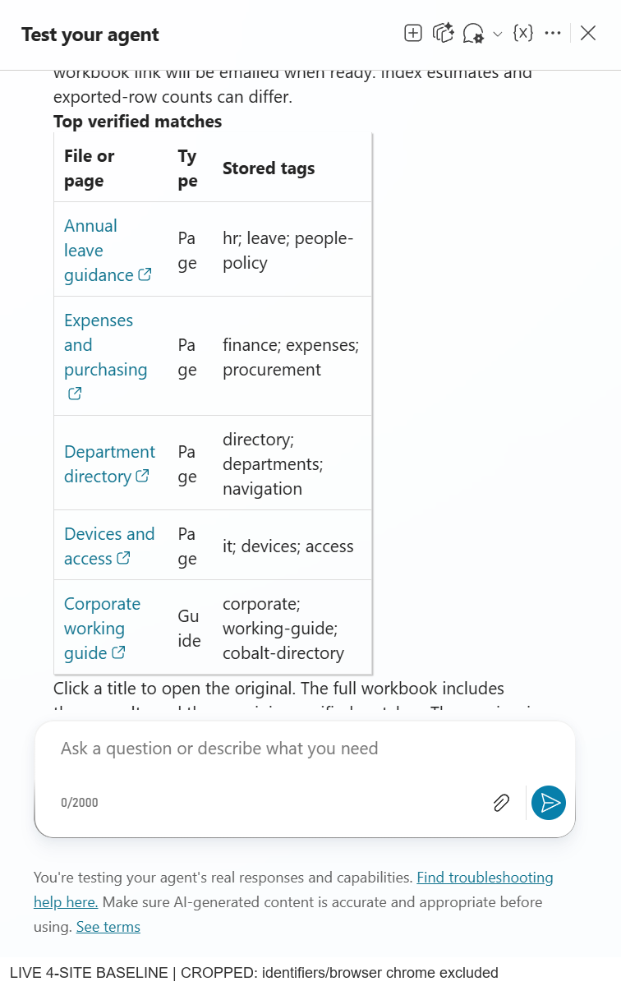
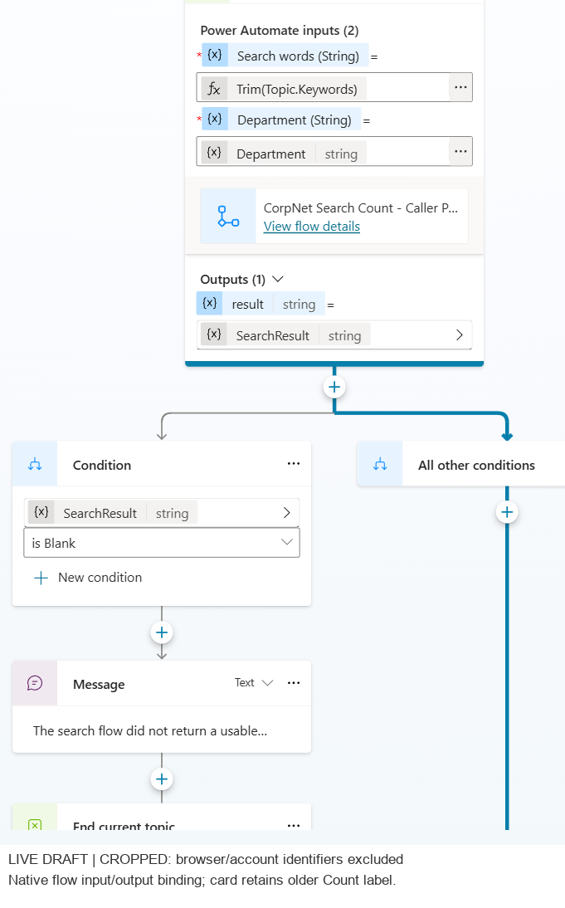
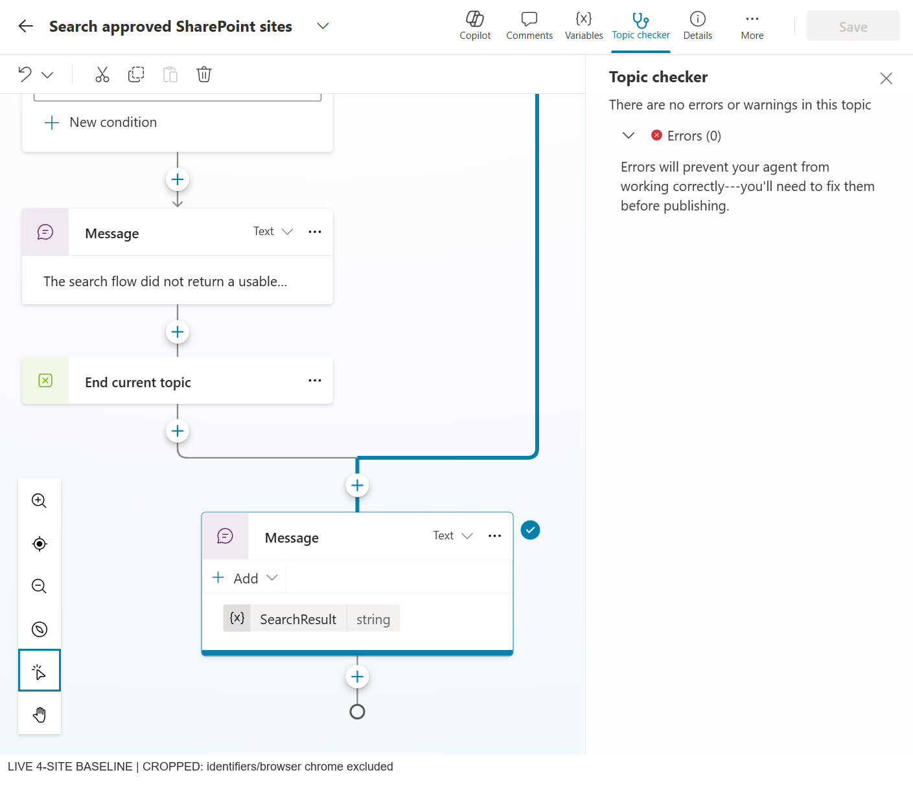

# Genuine product screenshots

These are **real Copilot Studio draft captures**, cropped to remove browser
addresses, environment identifiers, account names/email and avatars. They are
not mockups. Cropping is visibly marked in each image; the displayed result
pixels were not fabricated or rewritten.

The captured conversation is the **historical four-site owner-account
baseline**. It shows the deployed **three-column** preview. The portable source
contains a newer two-column presentation, and a separate ten-site source
update was prepared later. These images do not prove either update was deployed.

## Linked search results

Prompt sequence: **`Search SharePoint` → `All` → `*`**.
The matching historical flow run exported and read back 17 rows. Five verified
source links and stored tags are visible in this chat capture. Narrow rendering
of the Type column motivated the newer two-column source presentation.

The initial response indicates that export has started. It is not evidence
that email delivery was already complete at that moment.

## Registered native flow binding

The topic passes search words and department to the native Power Automate
tool, then binds its string `result` to `SearchResult`. The existing card retains
an older **Count** display label; the independently checked active backend is
the search/export flow. A display label alone is not proof of runtime behavior.

## Controlled response and topic checker

The topic handles an unusable response explicitly and otherwise sends the
controlled `SearchResult`. The visible checker reports zero topic errors.
That observation does not replace conversation, connector or permission tests.

## Workbook screenshot boundary

No workbook UI screenshot is claimed here. The historical Excel connector
read-back contained 17 rows, but a fresh direct workbook download was blocked
by the available Graph permissions. No permissions or authentication settings
were changed to work around that restriction.

Blank workbook templates are included under [`agent/`](../agent/); they are
not screenshots or copies of a user's populated export.
