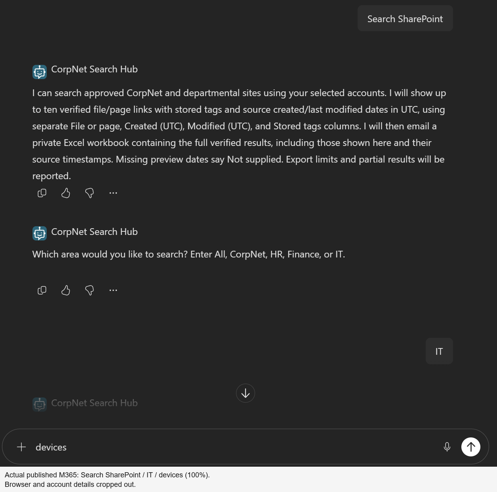
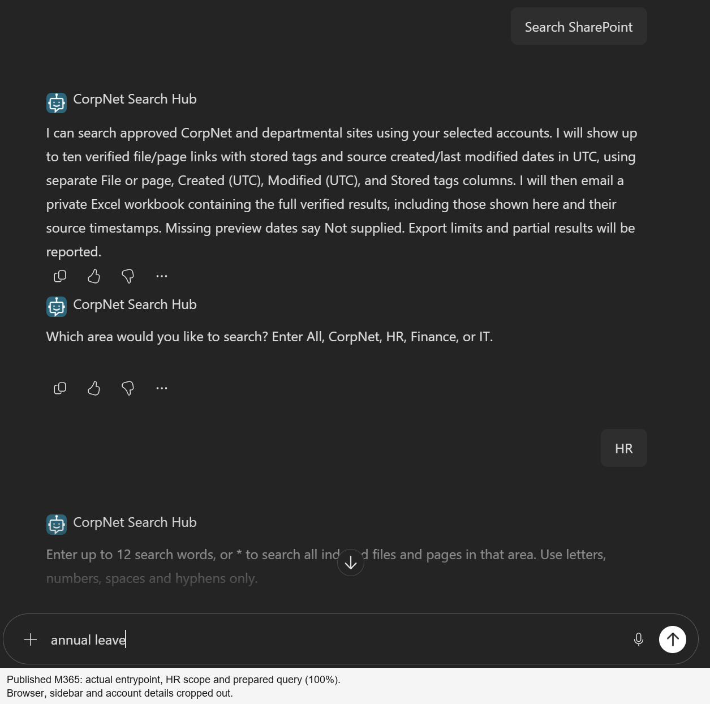
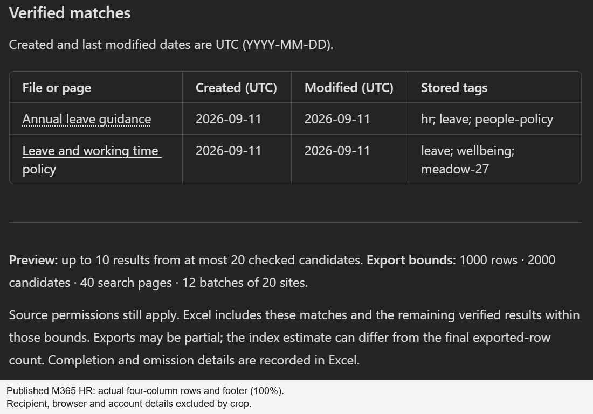
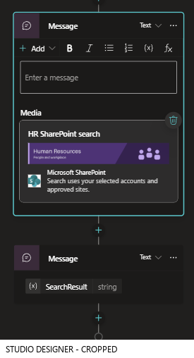
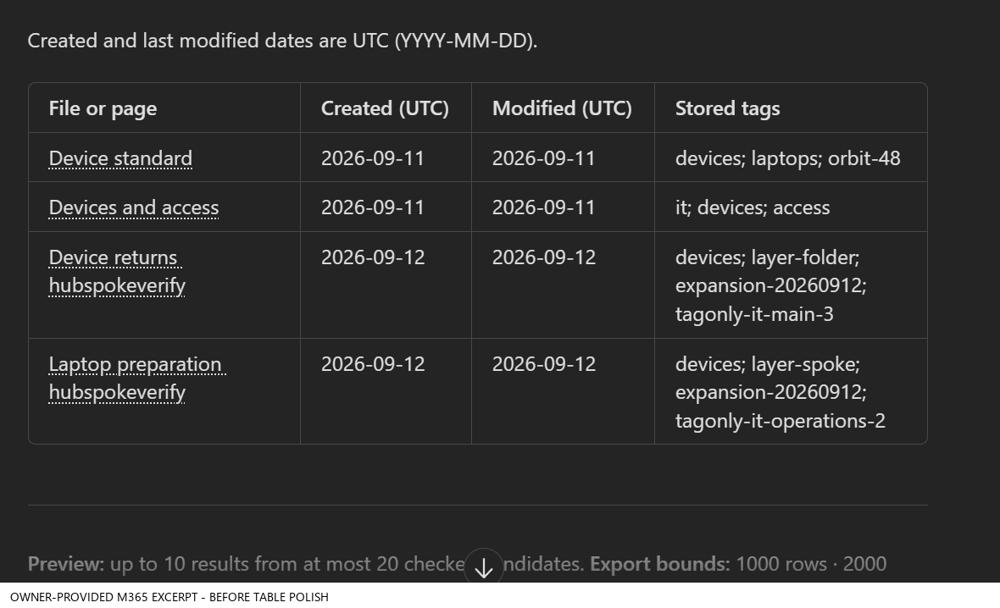
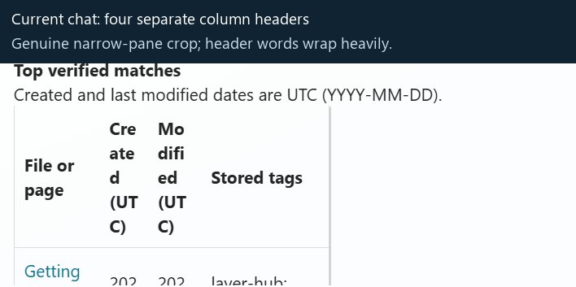
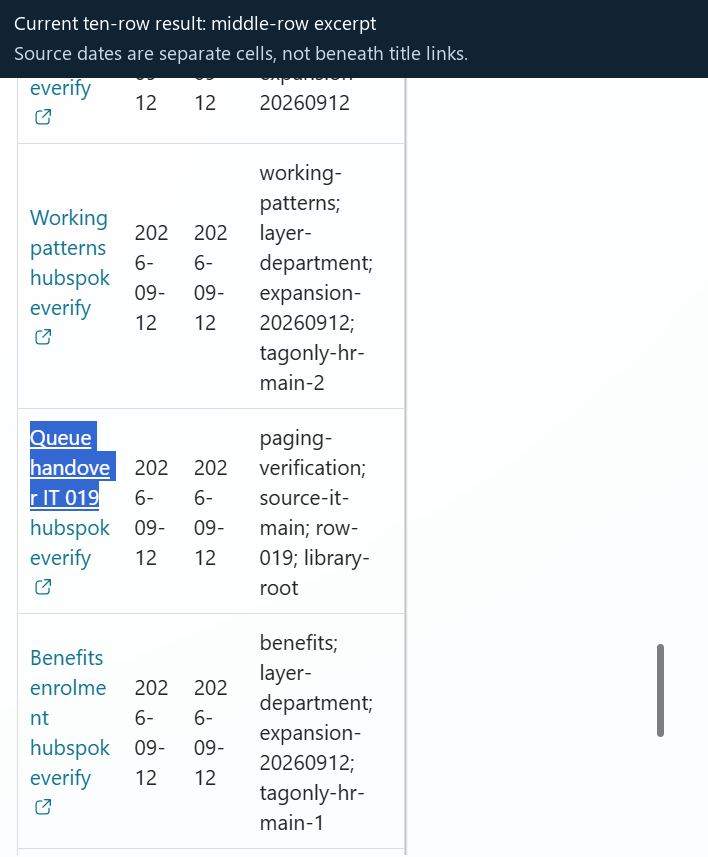
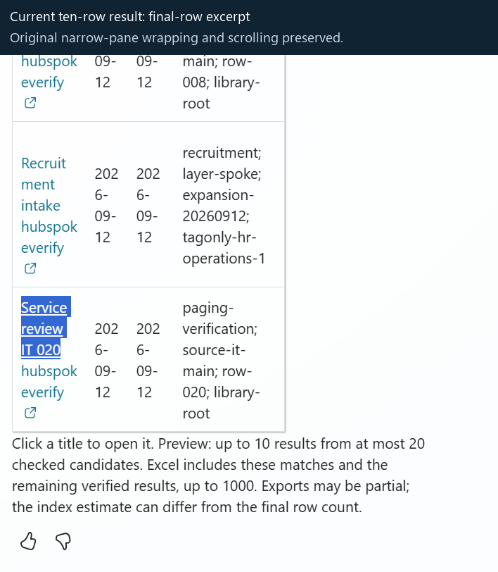
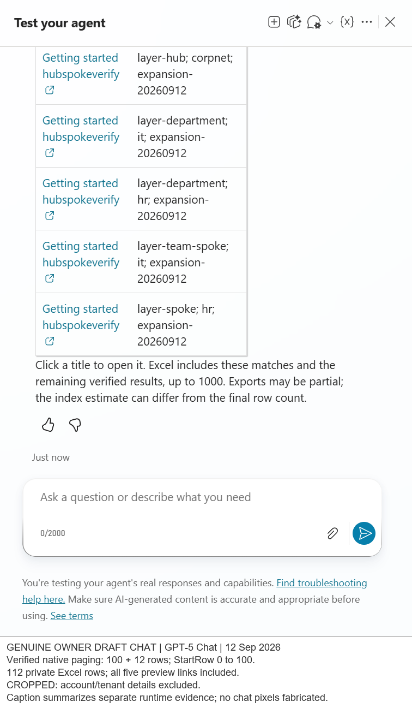
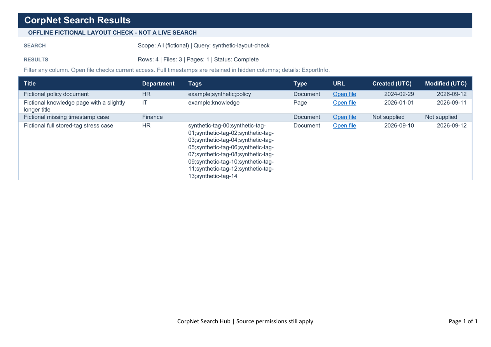

# Genuine product screenshots

These are **real product captures**, cropped to remove browser
addresses, environment identifiers, account names/email and avatars. They are
not mockups. Cropping is visibly marked in each image; the displayed result
pixels were not fabricated or rewritten.

Each section identifies the client, source and revision boundary. The owner
provided the published M365 Copilot image; the automation captured the Studio
and Excel evidence. Published output is not relabelled as an independently
executed channel test.

## Owner-provided 512-item preview

The owner supplied this image at **10:45:36 UTC on 13 September 2026**, after
the instruction to search `All` for `hubspokeverify`. The input sequence is not
in this screenshot; actual trigger inputs require separate run correlation.
The visible result reports **512 as an index estimate**, not a completed export
count. The original private image explicitly says export started and delivery
pending; its recipient block is entirely outside these publication crops.

The excerpt preserves four rows with linked page/file glyphs, separate created
and modified dates and wrapped stored tags. Dates remain visibly left-aligned.
It is not the entire ten-row preview or a complete response/footer capture.
The two crops are not stitched, rescaled or rewritten; only labelled provenance
footers were added. Browser zoom was not independently verified.

This owner-operated published-channel view is distinct from an automated
invocation. It does not by itself prove all six native search pages, 512
caller-hydrated sources, 512 Excel rows, final private access or email delivery.
Subsequent read-only checks of the **same owner-started native run passed**:
512 caller-hydrated sources and 512 Excel rows, exact metadata, private access
and one accepted verified-profile email. No additional query was submitted to
obtain evidence. Completion was established from connector results, not a new
workbook screenshot or an altered version of this pending-export image.

[Exact crop coordinates and hashes](scale-512-capture-provenance.json) ·
[Source/index checkpoint](scale-source-validation-summary.json) ·
[Completed native-run evidence](scale-runtime-validation-summary.json)

## Published M365 table polish

This single actual **IT / devices** request returned four source-verified rows:
one page and three documents. The bold linked glyphs and short monospace tags
rendered correctly; long plain tags wrapped without losing text. All four rows,
four distinct columns and the complete footer fit in this genuine 100% capture.
The same request verified the four-row private Excel export and email acceptance.

**Date centering did not render.** M365 retains the left inset even though the
returned Markdown includes centering markers. This is a recorded host limit,
not an offline-parser result presented as visual success. Tag labels are
monospace text, not custom-colored pills. No full new banner/header composite
was made; the earlier banner proof remains separate.

The [owner's earlier table excerpt](#owner-provided-table-before-table-polish)
provides a visual baseline, not a matched-input experiment. Its input sequence
was not captured. An additional owner-provided view of the updated icons is
not counted as another test invocation.

[Runtime summary](table-polish-validation-summary.json) ·
[Crops and provenance](table-polish-capture-provenance.json)

## Published M365 banner runtime

These are actual published-channel captures after the owner's republish,
not Studio previews. The banner-validation run still used the ordinary
four-column Markdown table, before table-specific polish.

The full response is one genuine viewport capture, not stitched output.
The recipient was irreversibly masked in the raster image. Browser/account
details were cropped out. The HR result contains one page and one document;
both source-linked rows and the private export were verified.

The explicit IT no-match message is below this banner crop. It was checked in
the actual M365 transcript and native run, with workbook/email writes skipped.
An attempted later full-output view showed different content and was excluded;
it was not relabelled as the IT result. Zoom was restored to 100%.

The actual linked-title rendering and returned message matched the native
response. Target URLs matched caller-hydrated source and Excel; links were not
navigated. These two-row/no-match tests do not re-exercise paging or establish
Teams, non-owner permissions or inbox receipt.

[Runtime summary](m365-validation-summary.json) ·
[Exact crops, masks and provenance](m365-capture-provenance.json)

## Department banner designer

This genuine, cropped **designer preview** shows the two-message arrangement:
contextual Adaptive Card first, existing `SearchResult` Markdown second. HR was
temporarily selected in the unsaved preview; the substitution was discarded,
and the persisted dynamic scope binding was rechecked. It is not a runtime
conversation or proof of M365 Copilot/Teams image delivery.

Both HR and IT artwork and the labelled SharePoint icon rendered in Studio's
card editor. The final topic checker reported no errors or warnings. The crop
removes browser/account/environment details; only a labelled footer was added.
[Capture provenance](banner-designer-provenance.json) records the exact crop.
The [original artwork gallery](../README.md#department-banners) is separate from
these product screenshots.

## Styled run inputs output and flow

These captures belong to the successful **HR / annual leave** Studio run after
the success-message styling change. It returned one page and one Word document,
verified two private Excel rows and accepted one verified-recipient email.
M365 required account selection, so the already-authorized Studio fallback
was used; no new authentication or published-channel test was performed.

The input image is immediately before submission; actual native trigger inputs
were separately verified. The output image shows the real rows and footer,
including narrow-pane wrapping. The heading/pending-delivery callout is above
that viewport; its actual bot activity was checked, not fabricated into the image.

### Native-flow capture index

| View | What it shows |
|---|---|
| [Overview and run history](images/styled-hr/native-flow-overview.png) | Active native flow and observed run history; displayed times are browser-local. |
| [Agent trigger and initialization](images/styled-hr/native-flow-entry.png) | Actual native entry and variable initialization excerpt. |
| [Initial search](images/styled-hr/native-initial-search.png) | RowLimit 100, StartRow 0, source-locator properties and SharePoint search action. |
| [Paging request](images/styled-hr/native-paging-request.png) | RowLimit remains 100 while StartRow uses PageStart; definition, not another live paging run. |
| [Current metadata read](images/styled-hr/native-source-metadata-read.png) | Dynamic source site, current-item GET and metadata-field handling. |
| [Response and continuation](images/styled-hr/native-response-and-continuation.png) | Format response, respond to agent, then continue private export. |
| [Excel append](images/styled-hr/native-excel-append.png) | Private workbook/table selection, source values and hyperlink formula. |
| [Final access gate](images/styled-hr/native-delivery-guard.png) | Final file ACL and delivery-access decision graph. |
| [Verified-recipient email](images/styled-hr/native-verified-recipient-email.png) | Dynamic profile-mail recipient and workbook-link delivery after the access gate. |

These are genuine read-only designer excerpts, not one full-flow diagram.
Some expression-backed conditions and response controls displayed blank/default
forms despite an unchanged authoritative definition and successful runtime.
Nothing was edited or saved; graph-only crops are used for those nodes. Do not
copy placeholder UI controls as if they described missing runtime guards.

[Full flow JSON](../agent/flows/search-export/definition.json) ·
[Walkthrough](flow-walkthrough.md) ·
[Safe provenance](styled-capture-provenance.json) ·
[Runtime summary](styled-validation-summary.json)

## Owner-provided published M365 Copilot output

The owner reported searching **HR / annual leave** and supplied this published
M365 Copilot screenshot on 12 September 2026. Unlike the narrow Studio pane,
this view renders the four columns and UTC dates clearly. It predates the
subsequent message-styling refinement.

The input sequence is owner-reported, not an input screenshot. The result
contains **Annual leave guidance**, a SharePoint page, and **Leave and working
time policy**, a Word document. Both titles remain source links; no separate
Type column is shown in chat.

The recipient email and surrounding account details were removed by cropping
above the result section. Original result pixels are unchanged. This is
two-result published-channel visual evidence, not proof of a ten-row published
layout, completed export, inbox receipt, another user's access or Teams rendering.

The current four-column, preceding paging and expanded captures show different
point-in-time owner draft runs. Three further images preserve the historical four-site baseline,
including its older three-column preview. Captions distinguish the versions
rather than relabel an old screenshot as a new test.

## Owner-provided table before table polish

The owner supplied this excerpt while reviewing the published M365 experience
on 12 September 2026. It shows four linked rows, separate UTC date columns and
stored tags in the ordinary client-styled grid. The exact scope/query input
and any banner above the table are not captured and are not inferred.

This is a visual baseline, not a separately executed channel or delivery test.
The supplied result pixels are unchanged; the publication copy adds only a
labelled footer and omits image metadata. [Provenance](owner-table-provenance.json)
records the source/output hashes and evidence limits.

## Historical 112-row Studio chat

The owner draft on **12 September 2026** returned ten genuine rows in four columns, with dates
separate from the linked title. These crops preserve actual product rendering,
including heavy header/date wrapping, scrolling and text selection. The run
passed 45 functional checks and exported 112 exact rows; it is not a polished
narrow-pane or Teams-client rendering claim.

Each title URL, tag value and UTC date matched caller-authenticated source
metadata and the same-run export. Screenshots show excerpts rather than a
fabricated single-screen view of all ten rows. These images predate the polished
M365 output and the 512-row run; "current" in older filenames refers to capture time.

## Paging-run linked results

Prompt sequence: **`Search SharePoint` -> `All` -> `hubspokeverify`**.
The actual native source-search requests returned **100 + 12 rows** with
RowLimit 100 and StartRow 0 then 100. Excel connector read-back verified
**112 unique rows**, including all five preview URLs. Private ACL and
verified-recipient email acceptance were checked.

The caption summarizes separate runtime evidence; the screenshot itself
shows the chat preview, not search cursors or workbook rows. This capture
predates the created/modified-date chat enhancement.

## Expanded linked search results

Prompt sequence: **`Search SharePoint` → `All` → `hubspokeverify`**.
The same native run exported and read back **52/52 expected rows across ten
approved collections**. It verified actual source metadata, a private owner
ACL and the email action to the verified profile mailbox.

The repeated page titles are deliberate fixture data. Each of these five rows
links to a different real source, and every preview URL was present in that
run's full export. Only the five-row preview appears in chat.

This is not proof of non-owner authorization, published-channel behavior or
search paging beyond 100 matching rows.

## Historical linked search results

Prompt sequence: **`Search SharePoint` → `All` → `*`**.
The matching historical flow run exported and read back 17 rows. Five verified
source links and stored tags are visible in this chat capture. Narrow rendering
of the Type column motivated the newer two-column source presentation.

The initial response indicates that export has started. It is not evidence
that email delivery was already complete at that moment.

## Registered native flow binding

The topic passes search words and department to the native Power Automate
tool, then binds its string `result` to `SearchResult`. The existing card retains
an older **Count** display label; the independently checked active backend is
the search/export flow. A display label alone is not proof of runtime behavior.

## Controlled response and topic checker

The topic handles an unusable response explicitly and otherwise sends the
controlled `SearchResult`. The visible checker reports zero topic errors.
That observation does not replace conversation, connector or permission tests.

## Actual generated workbook

This is the **actual generated workbook**, not a blank template or fictional
render. The visible sample shows the live scope/query, 112 rows / 99 files /
13 pages / Complete summary, compact top-aligned content and separate Created
and Modified UTC date columns. Full raw timestamps and technical URLs remain
in hidden columns. The generic `Open file` link label also opens page results;
the Type column distinguishes pages.

The associated run used the now-superseded two-column chat layout. Its workbook
evidence remains valid; it does not prove the later four-column chat correction.
All 112 rows and 224 date values were checked through connector read-back;
visual row-height checks covered a sample.

Earlier direct Graph workbook downloads were blocked. This capture used the
authorized owner's existing browser access, without changing permissions or
authentication settings. Historical exports read back 17, 52 and 16 rows;
both later paging and compact-workbook runs read back 112.

Blank workbook templates are included under [`agent/`](../agent/); they are
not screenshots or copies of a user's populated export.

## Offline workbook layout illustration

This is an **offline fictional layout check, not a live search workbook**.
It shows the compact masthead, actual-summary formula layout, top-aligned
rows, readable calendar dates, missing-date markers and a full long-tag stress
case. An isolated native Excel calculation reported zero formula errors.
The long final row is required by visible tag content, not hidden URL wrapping.

The historical template reproduced AutoFit row heights up to 409.5 points
when hidden raw URLs wrapped. Disabling hidden wrapping reduced that case
to 42 points; the compact layout then measured 14.5 points for its ordinary
short row. These controlled measurements identify a template defect and fix;
they are not measurements taken from the user's delivered workbook.
